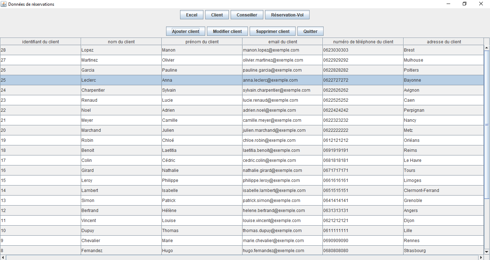

# Installation et Exécution
## Prérequis
- **Docker** : Assurez-vous que Docker est installé sur votre machine.
Vous pouvez télécharger Docker ici : [Docker](https://www.docker.com/products/docker-desktop).
- **Java 8 ou supérieur pour l'exécution** : L'application Java nécessite une version de Java compatible.
Vous pouvez télécharger Java ici : [Java]([https://www.oracle.com/java/technologies/javase-jdk8-downloads.html](https://www.java.com/fr/download/manual.jsp)).

## Étapes d'installation

### 1. Cloner le repository

Clonez le repository GitHub sur votre machine locale :

```bash
git clone https://github.com/lgvua/gestion-reservations-vols.git
```

```bash
cd travel-booking-system
```

### 2. Environnement Docker

Exécutez la commande suivante pour démarrer l'environnement Docker :

```bash
docker-compose up -d
```

Cette commande téléchargera l'image de la base de données PostgreSQL (si elle n'est pas déjà présente) et lancera un conteneur contenant la base de données, tout en initialisant la base de données à l'aide du fichier init.SQL .

### 3. Lancer l'application

Pour lancer l'application Java, cliquez sur le fichier `Application_projet_lkm.jar`.

Si votre système d'exploitation ne reconnaît pas ce fichier comme un programme cliquable, vous pouvez l'exécuter en utilisant la commande suivante :

```bash
java -jar Application_projet_lkm.jar
```

# Système de gestion des réservations  

## Principales fonctionnalités 

### Gestion des clients  
- **Ajouter un client :** Informations requises : nom, prénom, email, adresse, téléphone.  
- **Modifier un client :** Mise à jour des informations : nom, prénom, email, adresse, téléphone.  
- **Supprimer un client.**  

### Gestion des conseillers  
- **Ajouter un conseiller :** Informations requises : nom, prénom, email, téléphone.  
- **Modifier un conseiller :** Mise à jour des informations : nom, prénom, email, téléphone.  
- **Supprimer un conseiller.**  

### Gestion des vols et réservations  
- **Ajouter une réservation.**  
- **Ajouter un vol.**  
- **Supprimer une réservation.**  

## Modèle conceptuel de données


## Modèle physique de données


## Images




## Compiler les sources
